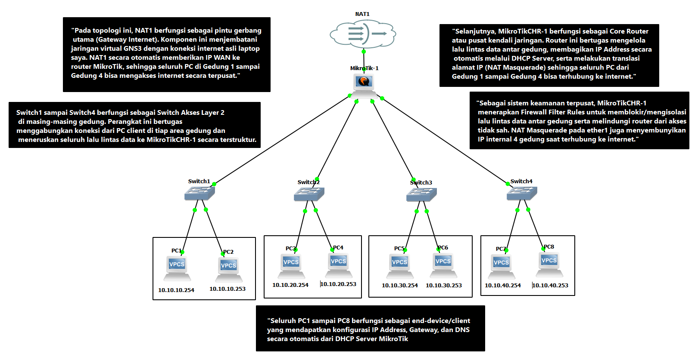

# Multi-Building Network Architecture & Security Gateway



## 📌 Ringkasan Proyek
Simulasi arsitektur jaringan terpusat untuk 4 area gedung menggunakan **MikroTik CHR** pada simulator **GNS3**. Implementasi ini mencakup otomatisasi IP (*DHCP Server*), akses internet terpusat (*NAT Gateway*), serta kebijakan keamanan (*Firewall Filter Rules*) untuk isolasi antar-gedung.

---

## 📐 Skema Pengalamatan IP & Interface

| Interface | Lokasi / Target | Subnet | IP Gateway | Peran |
| :--- | :--- | :--- | :--- | :--- |
| **ether1** | WAN (NAT1) | Dynamic | Dynamic | Uplink Internet |
| **ether2** | Gedung 1 | `10.10.10.0/24` | `10.10.10.1` | LAN Client Gedung 1 |
| **ether3** | Gedung 2 | `192.168.20.0/24` | `192.168.20.1` | LAN Client Gedung 2 |
| **ether4** | Gedung 3 | `192.168.30.0/24` | `192.168.30.1` | LAN Client Gedung 3 |
| **ether5** | Gedung 4 | `192.168.40.0/24` | `192.168.40.1` | LAN Client Gedung 4 |

---

## ⚙️ Skrip Konfigurasi Utama (RouterOS)

```routeros
# 1. Interface WAN & IP LAN
/ip dhcp-client add interface=ether1 disabled=no
/ip address add address=10.10.10.1/24 interface=ether2 comment="Gedung 1"
/ip address add address=192.168.20.1/24 interface=ether3 comment="Gedung 2"
/ip address add address=192.168.30.1/24 interface=ether4 comment="Gedung 3"
/ip address add address=192.168.40.1/24 interface=ether5 comment="Gedung 4"

# 2. Setup DHCP Server (Automatic Addressing)
/ip dhcp-server setup interface=ether2 lease-time=03:00:00 address-pool=pool-g1
/ip dhcp-server setup interface=ether3 address-pool=pool-g2
/ip dhcp-server setup interface=ether4 address-pool=pool-g3
/ip dhcp-server setup interface=ether5 address-pool=pool-g4

# 3. NAT Gateway (Akses Internet)
/ip firewall nat add chain=srcnat out-interface=ether1 action=masquerade comment="NAT Internet"

# 4. Firewall Filter Rules (Keamanan & Isolasi)
/ip firewall filter add chain=input connection-state=established,related action=accept comment="Allow Established"
/ip firewall filter add chain=input in-interface=ether1 action=drop comment="Drop WAN Access to Router"
/ip firewall filter add chain=forward src-address=10.10.10.0/24 dst-address=192.168.20.0/24 action=drop comment="Isolate G1 to G2"
```

## 🧪 Hasil Pengujian & Verifikasi

* **Alokasi DHCP:** Executed `ip dhcp` pada VPCS client — IP, Gateway, dan DNS terkonfigurasi otomatis.
* **Akses Internet:** Ping dari PC client internal ke `8.8.8.8` — **REPLY** (Transmitted via NAT Masquerade).
* **Isolasi Firewall:** Ping dari PC Gedung 1 (`10.10.10.x`) ke Gedung 2 (`192.168.20.x`) — **TIMEOUT / DROPPED** (Filter Rule Aktif).
